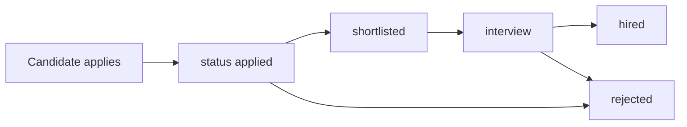
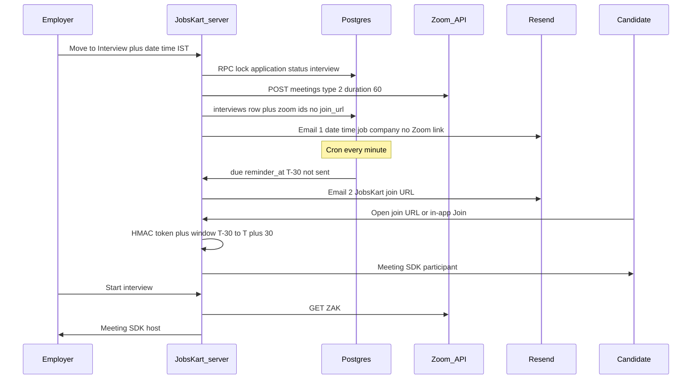

# Zoom in-app interviews — implementation plan

## What already exists (do not rebuild)

The hiring funnel and a **partial** interview model are already in the database and UI. Zoom is not.

**Pipeline today**

- Status enum: `applied | shortlisted | interview | hired | rejected | withdrawn` in [supabase/migrations/20260617111751_66a186bd-1332-4c08-9ce7-ae5e0d3c4349.sql](supabase/migrations/20260617111751_66a186bd-1332-4c08-9ce7-ae5e0d3c4349.sql). UI labels live in [src/lib/applicantStatus.ts](src/lib/applicantStatus.ts).
- Employer changes status with a **direct client update** on `applications` (no RPC) on [jobs.$jobId.applicants.tsx](src/routes/_authenticated/employer/jobs.$jobId.applicants.tsx), [interviews.tsx](src/routes/_authenticated/employer/interviews.tsx) (page is a filtered applicant list, **not** a calendar), and [responses.tsx](src/routes/_authenticated/employer/responses.tsx).
- Status email exists **only** from Responses: `supabase.functions.invoke("application-status-notify")`. Applicants and Interviews pages **do not** send mail. Template copy for `interview` is “they'll be in touch” — **no date, time, or link** ([templates.ts](supabase/functions/_shared/templates.ts), [application-status-notify](supabase/functions/application-status-notify/index.ts)).
- Table `public.interviews` already has `scheduled_at`, `duration_min` (default **30**), `meeting_url`, `mode` enum `video|phone|onsite`, status `scheduled|confirmed|rescheduled|cancelled|completed`, plus an insert trigger that writes `notifications` and `employer_activity` ([20260714063327_...](supabase/migrations/20260714063327_7d09a88f-b222-408b-8844-a26fe633acb5.sql)).
- [ScheduleInterviewDialog.tsx](src/components/employer/ScheduleInterviewDialog.tsx) is **dead code** (never imported). It writes invalid `mode` values (`online` / `in_person`) vs the DB enum, and asks the employer to **paste** a Meet/Zoom URL. Candidate UI already renders `meeting_url` in [InterviewInfo.tsx](src/components/candidate/InterviewInfo.tsx) on [applications.tsx](src/routes/_authenticated/candidate/applications.tsx). Notification link `/candidate/interviews` is **stale** (that route is gone).

**Email / cron already in the stack**

- Resend via Edge Function secrets (`RESEND_API_KEY`, `RESEND_FROM_EMAIL`) in [resend.ts](supabase/functions/_shared/resend.ts).
- `pg_cron` + `pg_net` already hit Edge Functions for alert digests ([20260914075503_alert_job_notifications.sql](supabase/migrations/20260914075503_alert_job_notifications.sql)). Same pattern for T-30 reminders. Note: **pg_cron needs Pro+**; if the project is Free, reminders will not fire until that is enabled.

**Ground rules that this feature must obey**

- Zoom credentials never in the browser. Mirror Razorpay: TanStack `createServerFn` + `requireSupabaseAuth` ([credits.functions.ts](src/lib/credits.functions.ts)).
- Privileged writes (schedule, cancel, mint join/host tokens) go through **SECURITY DEFINER RPCs** with `has_company_role` / `has_company_membership` — not raw client `insert` on `interviews`.
- Do not put Zoom `join_url` / `start_url` / ZAK in any column the candidate can `SELECT` (today they can read `meeting_url`).
- New schema **only** as a new migration file; never edit old ones.
- AI/provider isolation is irrelevant here. Activity logging already exists on interview insert; extend for reschedule/cancel/join.

**Chosen product shape (your answers)**

- Host account: **one JobsKart Zoom account** via Marketplace **Server-to-Server OAuth** (employers never log into Zoom).
- In-meeting UX: **Zoom Meeting SDK for Web** embedded in JobsKart. Employer JWT `role=1` + fresh **ZAK**; candidate JWT `role=0` (no ZAK). Employer gets native Zoom host controls (mute, waiting room admit, remove, share, chat, end meeting). Recording only if the Zoom **plan** allows it — treat as optional, not a v1 requirement.

Do **not** build a custom WebRTC stack. “From scratch” here means JobsKart owns scheduling, tokens, emails, and the in-app join — Zoom supplies media.

---

## Target flow

**Calendar rule:** `scheduled_at` must be **≥ start of tomorrow in `Asia/Kolkata`** (not today IST). Store UTC `timestamptz`; display IST.

**Link rule:** Zoom’s own `join_url` does **not** expire in 60 minutes. Email 2 must use a **JobsKart** URL (`/interview-join?t=...`). Server allows join only when `now` is in `[scheduled_at - 30min, scheduled_at + 30min]` (60 minutes covering 30 before + 30 after start). Meeting `duration` on Zoom = **60** minutes. After the window: show expired UI; do not mint SDK JWT.

**Email 1 vs status mail:** Moving to Interview without a slot can keep the existing generic status mail. The **scheduling** mail is a new template (date, IST time, duration, job, company, interviewer name, “join link arrives 30 minutes before”). Do not include Zoom IDs or `join_url` in email 1.

**Email 2:** T-30, subject like “Your interview starts in 30 minutes”, body with JobsKart join button + IST time + “link works for 60 minutes”. Idempotent: `reminder_email_sent_at` so cron retries cannot double-send.

---

## Zoom platform work (ops, before code ships)

1. Zoom Marketplace app: **Server-to-Server OAuth** on the JobsKart account. Scopes at least: `meeting:write:meeting:admin`, `meeting:read:meeting:admin`, `meeting:update:meeting:admin`, `meeting:delete:meeting:admin`, `user:read:token:admin`.
2. Second Marketplace app: **Meeting SDK** (Web). Client ID/Secret used **only** on the server to sign JWTs (`mn`, `role`, `iat`, `exp`/`tokenExp` — Zoom requires JWT lifetime **≥ 30 min**; mint at click time with ~1h `exp`, still **gate join in our app**).
3. Secrets (server / Edge only, add to `.env.example`): `ZOOM_ACCOUNT_ID`, `ZOOM_CLIENT_ID`, `ZOOM_CLIENT_SECRET`, `ZOOM_HOST_USER_ID` (or host email), `ZOOM_SDK_KEY`, `ZOOM_SDK_SECRET`, `INTERVIEW_JOIN_HMAC_SECRET`.
4. **License reality:** a typical single Zoom host allows **one concurrent meeting**. Same-time interviews will collide. v1: RPC rejects overlapping slots on the platform host (or warn and queue). Document upgrade path (multiple licensed users / alternative hosts) as v2.

`start_url` ZAK expires in **~2 hours**. Never store it. Always `GET /users/{host}/token?type=zak` when the employer clicks Start.

---

## Data model (new migration only)

Extend `interviews` (do not reuse `meeting_url` for Zoom):

- `zoom_meeting_id text`, `zoom_meeting_uuid text`, `zoom_password_encrypted text` (or store password server-only; never select for `authenticated` candidate)
- `timezone text not null default 'Asia/Kolkata'`
- `duration_min` default **60**
- `reminder_email_sent_at timestamptz`, `scheduled_email_sent_at timestamptz`
- `cancelled_at`, `reschedule_of uuid` optional
- Check: `scheduled_at >= (date_trunc('day', now() AT TIME ZONE 'Asia/Kolkata') + interval '1 day') AT TIME ZONE 'Asia/Kolkata'` **on insert/reschedule of future slots** (allow past rows for completed history)

**Do not** expose Zoom columns via PostgREST to candidates. Options: (a) put Zoom secrets in a `interview_zoom_secrets` table with **no** GRANT to `authenticated`, only `service_role`; (b) candidate-facing view that omits them. Prefer (a).

`meeting_url` stays null for video interviews; in-app join replaces it.

**RPCs (SECURITY DEFINER, `search_path = public`, membership checks):**

- `schedule_video_interview(application_id, scheduled_at, notes)` — requires application `status` already `interview` **or** sets it in the same txn; requires `has_company_role(..., ARRAY['super_admin','hr_admin','recruiter'])`; one **active** video interview per application; row-lock application; writes `employer_activity`.
- `reschedule_video_interview` / `cancel_video_interview` — PATCH/DELETE Zoom meeting; reset reminder flags on reschedule; emails.
- Read helpers for employer calendar and candidate “upcoming interview” **without** Zoom secrets.

**Cron:** `interview-reminders` every minute: `scheduled_at - interval '30 minutes' <= now()` AND `reminder_email_sent_at IS NULL` AND `status = 'scheduled'` AND `mode = 'video'`. Claim with `UPDATE ... RETURNING` so two cron ticks cannot double-send.

---

## Server modules (TanStack, not Edge, for Zoom)

Follow [architecture.md](prompt%20structure/architecture.md): privileged Zoom I/O in `src/lib/*.functions.ts`, not the browser.

| File                                                                  | Responsibility                                                                                                 |
| --------------------------------------------------------------------- | -------------------------------------------------------------------------------------------------------------- |
| `src/lib/zoom/client.ts`                                              | S2S token cache, create/update/delete meeting, fetch ZAK                                                       |
| `src/lib/zoom/sdk-jwt.ts`                                             | Meeting SDK signature (host vs participant)                                                                    |
| `src/lib/interview-join.ts`                                           | HMAC token mint/verify, 60-min window (pure, unit-testable)                                                    |
| `src/lib/interview.functions.ts`                                      | `scheduleInterview`, `rescheduleInterview`, `cancelInterview`, `getHostJoinPayload`, `getCandidateJoinPayload` |
| `src/routes/interview-join.tsx`                                       | Public-ish join page: logged-in candidate + valid token → SDK                                                  |
| `src/routes/_authenticated/employer/interview-room.$interviewId.tsx`  | Host room                                                                                                      |
| `src/routes/_authenticated/candidate/interview-room.$interviewId.tsx` | Participant room (also used from email token)                                                                  |

Wire UI to **server functions**, not `supabase.from("interviews").insert`.

**Reminders / email 1:** keep Resend in Edge Functions (secrets already there). Add templates `interviewScheduledEmail` and `interviewReminderEmail`. New function `interview-email` (JWT for schedule path; service role for cron). `scheduleInterview` server fn invokes it after RPC+Zoom succeed. pg_cron → `interview-reminder` like `alert-digest`. If Zoom create fails: **do not** leave a dangling scheduled row; roll back RPC or mark `status` failed and show the employer (ground rule: third-party failure must not silently look successful). If Resend fails: interview still exists; in-app notification remains; retry email via cron/`scheduled_email_sent_at`.

---

## UI changes

**Employer**

- On status → `interview` (applicants, interviews, responses): open a **Schedule video interview** modal (replace dead dialog). Fields: date (min = tomorrow IST), time (15-min steps), duration fixed 60 for v1, notes. Block submit if not tomorrow+.
- After schedule: show IST datetime, “Candidate gets the join link 30 minutes before”, **Start interview** (disabled until window, or allow host 15 min early so they can open waiting room).
- [employer/interviews.tsx](src/routes/_authenticated/employer/interviews.tsx): list **scheduled rows** from `interviews`, not only `applications.status = interview`. Actions: reschedule, cancel, start.
- Host Meeting SDK page: waiting room on, `join_before_host: false`, employer name from profile. Host-only: mute, unmute, remove, admit, end. Do not show candidate the host toolbar.

**Candidate**

- Applications list: upcoming video interview with countdown; **Join** enabled only in the 60-min window; otherwise “Join opens 30 minutes before”.
- No persistent Zoom URL in the card.
- Email 2 and in-app use the same token/window.
- Fix notification `link` to `/candidate/applications` (or the new room route).

**Wire status notify** on applicants + interviews pages the same as responses (or fold notify into the schedule RPC so it cannot be forgotten).

---

## Edge cases (must be in v1)

- **Today / past:** reject in RPC and UI (IST).
- **No candidate email:** skip Resend; keep in-app notification; toast employer “email missing”.
- **Reschedule:** PATCH Zoom `start_time`; clear `reminder_email_sent_at` if new T-30 is in the future; send a new “rescheduled” email 1; cancel old reminder.
- **Cancel / reject / withdraw / hired:** cancel Zoom meeting; skip reminder; optional cancel email.
- **Double schedule:** one active video interview per application.
- **Bulk “move to interview”:** do not auto-Zoom; require per-candidate slot (or a follow-up queue).
- **Employer starts late:** candidate waits in waiting room until host SDK + ZAK; show “waiting for interviewer”.
- **Candidate arrives early:** before T-30, deny join.
- **Candidate arrives after window:** expired page; employer can reschedule.
- **Tab refresh mid-call:** remint JWT/ZAK server-side; same meeting id.
- **Concurrent interviews:** reject overlap on platform host.
- **Zoom API down:** schedule fails with mapped error; application can stay `interview` without a meeting (employer retries).
- **Cron miss:** if `now` already past T-30 and reminder unsent, still send once if still inside the 60-min window; if window passed, skip.
- **Clock skew:** validate window server-side only; HMAC `exp` matches window end.
- **Token leak:** HMAC includes `interview_id`, `candidate_id`, `exp`; candidate must be logged in as that user to join (email link deep-links to login then room).
- **Host URL leak:** never email `start_url` or ZAK.
- **Phone/onsite:** out of Zoom scope; keep existing `mode` for later; this feature is `video` only.
- **Job `interview_type` in_person/telephonic:** posting metadata only; does not block video round.
- **RLS footgun:** current `applications` UPDATE policy allows the **candidate** to change status — do not rely on it for schedule; RPCs must check employer role. (Optional hardening in the same migration.)
- **Meeting SDK + CSP / Vite:** SDK loads WASM from Zoom CDNs; allow in CSP if you add one; test Chrome + mobile Safari (blue-collar candidates often join on phone — Meeting SDK Web on small screens is a real risk; provide “Open in Zoom app” fallback using a **server-issued** join that still time-gates, e.g. redirect to Zoom `join_url` only after window check so the 60-min rule holds even if Zoom’s URL would otherwise live forever).
- **DPDP / recording:** default recording **off**; if enabled later, disclose in email 1.

---

## Implementation order (testable slices)

1. Migration + RPCs + IST min-date + overlap check + secrets table (no Zoom yet; mock meeting id).
2. `interview-join` HMAC + window unit tests in `src/lib/interview-join.ts`.
3. `src/lib/zoom/client.ts` + schedule server fn + employer modal wired; email 1.
4. pg_cron reminder + email 2; idempotency.
5. Meeting SDK host + participant routes; waiting room; Start/Join gating.
6. Reschedule/cancel + status-page notify parity + fix candidate notification link.
7. Failure modes: Zoom down, no email, overlap, expired token — employer/candidate copy.

No test runner is configured in this repo (`package.json` has no `test`). Add a small `bun` script only for the pure join-window/HMAC module, or assert via manual checklist + SQL.

**Manual verification (browser, required by project rules):** employer schedule from applicants; candidate applications card; email 1 contents; wait or stub `scheduled_at`; email 2; candidate join denied outside window; employer host controls; reschedule; cancel.

---

## Out of scope for this first ship

- Employer-connected Zoom OAuth
- Custom Video SDK UI
- Calendar invites (.ics) unless you want them in email 1 as a cheap extra
- WhatsApp reminder (prefs exist; not requested)
- AI interview / recording playback
- Multi-host licensed concurrency

