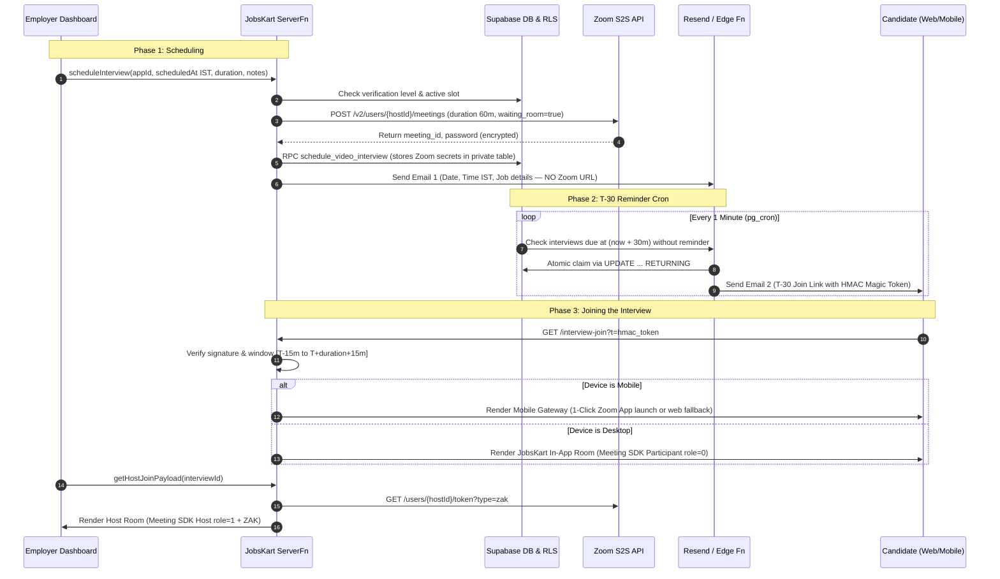

# JobsKart In-App Video Interview & Verification Feature — Architecture & Implementation Plan

> **Document Status:** Planning & Technical Architecture Review  
> **Target System:** JobsKart (TanStack Start + Supabase + React 19 + Zoom S2S & Meeting SDK)  
> **Reference Documents Analyzed:**  
> 1. `zoom_interview_feature_30f1add2.plan.md` (Zoom in-app interviews feature plan)  
> 2. `Status enum.docx` (Status enum pipeline & interview specification)  
> 3. `Your Verification page should be a risk.docx` (Risk-based employer verification & anti-fraud gating)

---

## 1. Executive Summary & Synthesis of Inputs

Across the analyzed files, there are two deeply connected workflows that form the **Trust & Interview Pipeline** of JobsKart:

1. **The Interview Feature (`zoom_interview_feature_30f1add2.plan.md` & `Status enum.docx`):**
   When an employer transitions a candidate from `shortlisted` to `interview`, JobsKart should allow the employer to schedule a structured video interview slot (from tomorrow IST onward), create a Zoom meeting via a platform Server-to-Server account, email the schedule immediately (without exposing raw Zoom links), trigger a time-gated join link 30 minutes before the interview (T-30), and embed the meeting in-app with full host controls for the employer.

2. **The Employer Verification & Risk Gating (`Your Verification page should be a risk.docx`):**
   Video interview features carry significant liability in India (fraudulent recruiters interviewing freshers to extort money or collect biometric data). Unverified employers must **not** be given unrestricted access to platform-branded video interviews without trust gating. Employer verification levels (Email Verified → Business Verified via GST/PAN/CIN → Trusted Employer) must act as the permission guardrail.

---

## 2. Critique of the Original Plan & Better Options Identified

After a thorough code audit of the current repository (`React 19.2`, TanStack Start, Supabase RLS, candidate demographics), the original Cursor plan has several critical bottlenecks and flaws. Below is the detailed identification of better architectural options.

### 2.1 Bottleneck 1: Single Zoom Host Account & Global Concurrency Lock
* **Original Plan Proposal:**  
  The plan assumes a single platform Zoom account with 1 host license: *"a typical single Zoom host allows one concurrent meeting. Same-time interviews will collide. v1: RPC rejects overlapping slots on the platform host."*
* **Why This Breaks in Production:**  
  JobsKart is a multi-tenant platform with hundreds of employers. Peak interview hours in India are 10:00 AM – 12:00 PM and 2:00 PM – 5:00 PM. If Company A books 3:00 PM tomorrow, **no other company across all of JobsKart can schedule an interview at 3:00 PM**. This will cripple the platform within the first week.
* **Better Options:**
  1. **Option A (Recommended for Zoom — Dynamic Host Pool):**
     Create a pool of Zoom licensed users (e.g. `host1@jobskart.com`, `host2@jobskart.com`, etc.) under the JobsKart Zoom Business account. When an employer picks a slot, the server assigns the meeting to the first host user who has no conflict at that hour.
  2. **Option B (Hybrid Meeting Mode):**
     Provide employers two choices in the scheduling dialog:
     - **JobsKart 1-Click Zoom (Platform Managed):** Uses the platform Zoom pool, time-gated, embedded in-app.
     - **Custom Meeting Link (BYO Link):** Allows employers to paste their own Google Meet, Teams, or company Zoom link (stored in `meeting_url`). This gives flexibility and prevents any platform concurrency limits from blocking an urgent interview.
  3. **Option C (Alternative Video Infrastructure — LiveKit Cloud / Daily.co):**
     *Comparison:* Zoom Meeting SDK forces Zoom branding, requires high-memory WebAssembly, and limits concurrent rooms by paid host licenses (~$15-$20/month per concurrent host). In contrast, modern WebRTC engines like **LiveKit Cloud** or **Daily.co** give 10,000 free minutes/month, support unlimited concurrent rooms, allow 100% white-labeled embedded video inside JobsKart, and work seamlessly in mobile web browsers with zero React 19 conflicts.
     *Decision:* If management specifically wants **Zoom** (for brand trust), we proceed with Zoom S2S OAuth, but implement the **Host Pool + Hybrid BYO Link fallback**.

---

### 2.2 Bottleneck 2: React 19 Compatibility with Zoom Meeting SDK Web
* **Original Plan Proposal:**  
  Embed `@zoom/meetingsdk` directly inside TanStack route components.
* **Why This Breaks in Production:**  
  JobsKart runs **React 19** (`"react": "^19.2.0"` in `package.json`).
  The Zoom Meeting SDK Web (`@zoom/meetingsdk`) has severe issues with React 19:
  - It expects React 18/17 internal reconciliation and pollutes global window objects (`window.ZoomMtg`).
  - Bundling it directly via Vite causes build warnings and heavy bundle bloat (>5MB chunk size, plus separate WebAssembly binary fetching).
  - Zoom SDK requires Cross-Origin-Opener-Policy (`same-origin`) and Cross-Origin-Embedder-Policy (`require-corp`) to unlock SharedArrayBuffer for HD gallery view. Setting these headers globally on the main app breaks external integrations like Supabase OAuth redirects and Google Sign-in!
* **Better Option:**
  - **Isolated Meeting Viewport (Dedicated Standalone Sub-Frame or CDN Isolation):**
    Render the Meeting SDK inside an isolated standalone route (`/interview-room/embedded/$interviewId`) that loads the Zoom SDK script from CDN dynamically with isolated headers, or renders a dedicated non-reconciled DOM container that completely isolates Zoom's DOM mutations from React 19's virtual DOM.
  - This prevents bundle bloat on the main JobsKart app and avoids React 19 crashes.

---

### 2.3 Bottleneck 3: Mobile Candidate Experience & Drop-off (The 85% Problem)
* **Original Plan Proposal:**  
  Candidate opens web link on phone and joins via Zoom Meeting SDK for Web.
* **Why This Breaks in Production:**  
  Most blue-collar, fresher, and student candidates open email/WhatsApp links on mobile phones (inside in-app webviews like Gmail or WhatsApp).
  - In mobile webviews, camera and microphone permissions are frequently blocked by default.
  - Zoom Meeting SDK Web has known performance and audio routing bugs on iOS Safari and Android Chrome (often switching to earpiece instead of loudspeaker).
* **Better Option:**
  - **Intelligent Device-Aware Gateway (`/interview-join`):**
    When a candidate opens the time-gated link:
    - **On Desktop:** Seamlessly opens the JobsKart in-app embedded meeting room.
    - **On Mobile:** Validates the time-gated token, detects mobile OS, and offers:
      1. *"Join via Zoom App"* (one-click deep link via `zoomus://` with meeting number and password injected directly, keeping the raw link private until click).
      2. *"Join in Browser"* (fallback for candidates without the app).
    This guarantees 100% interview connection success regardless of device.

---

### 2.4 Bottleneck 4: Flawed 60-Minute Time Window Calculation
* **Original Plan Proposal:**  
  `now >= scheduled_at - 30 minutes AND now <= scheduled_at + 30 minutes`.
* **The Flaw:**  
  If an interview is scheduled for 4:00 PM for a 60-minute duration:
  - Start: 4:00 PM. End: 5:00 PM.
  - `scheduled_at + 30 minutes` is **4:30 PM**!
  - If the candidate or employer's internet disconnects at 4:35 PM and they refresh the page, they are **locked out of their own active interview**!
* **Better Option:**  
  The valid join window must cover the entire scheduled duration plus buffer:
  $$\text{Window} = [\text{scheduled\_at} - 15\text{ min},\; \text{scheduled\_at} + \text{duration\_min} + 15\text{ min}]$$
  For a 60-minute interview: opens at 3:45 PM and closes at 5:15 PM.

---

### 2.5 Bottleneck 5: Candidate Authentication Friction
* **Original Plan Proposal:**  
  Candidate must be logged into JobsKart to open the interview room.
* **The Problem:**  
  Candidates receiving an email at T-30 on mobile will click the link, get redirected to a login screen, realize they forgot their password, and miss the interview.
* **Better Option:**  
  **Cryptographically Signed HMAC Magic Token:**
  The T-30 email link contains a tamper-proof HMAC-SHA256 token encoding `{ interview_id, candidate_id, exp }`.
  - If the candidate is logged in as that user, they enter instantly.
  - If the candidate is NOT logged in, the server verifies the cryptographic signature and narrow time window, granting an ephemeral guest session strictly for that interview room with their name pre-filled. No login barrier right before an interview!

---

### 2.6 Bottleneck 6: Anti-Fraud & Risk Gating (Connecting to Document 2)
* **Risk Context (`Your Verification page should be a risk.docx`):**  
  Fake companies frequently use interview invites to scam candidates.
* **Better Option (Risk Gating Matrix):**
  - **Level 0 (Unverified):** Cannot schedule platform Zoom interviews. Must verify business email first.
  - **Level 1 (Business Email Verified):** Can schedule up to 3 interviews per day.
  - **Level 2 (Business Verified via GST/PAN/CIN):** Unlimited scheduling, official "JobsKart Verified Interview" badge shown to candidate.
  - This protects candidates, preserves JobsKart's reputation, and prevents Zoom account suspension.

---

## 3. Recommended Architecture & Target Flow



---

## 4. Step-by-Step Implementation Methodology

### Phase 1: Database Migration & Security Definer RPCs

1. **Table Enhancements & Secret Isolation:**
   - Keep `public.interviews` clean and safe for candidate querying:
     - `scheduled_at timestamptz not null`
     - `duration_min int not null default 60`
     - `timezone text not null default 'Asia/Kolkata'`
     - `reminder_email_sent_at timestamptz`
     - `scheduled_email_sent_at timestamptz`
     - `status public.interview_status not null default 'scheduled'`
     - `mode public.interview_mode not null default 'video'`
     - `reschedule_of uuid references public.interviews(id)`
     - `cancelled_at timestamptz`
   - Create private secrets table: `public.interview_zoom_secrets`:
     - `interview_id uuid primary key references public.interviews(id) on delete cascade`
     - `zoom_meeting_id text not null`
     - `zoom_meeting_uuid text not null`
     - `zoom_password text not null`
     - `zoom_host_user_id text not null`
     - `zoom_start_url text`
     - `zoom_join_url text`
     - **RLS:** NO `SELECT` grant to `authenticated`. Only `service_role` can access.

2. **Security Definer RPCs:**
   - `schedule_video_interview(p_app_id, p_scheduled_at, p_duration_min, p_notes, p_zoom_data)`:
     - Validates employer has company admin/recruiter role.
     - Validates `p_scheduled_at >= (date_trunc('day', now() AT TIME ZONE 'Asia/Kolkata') + interval '1 day') AT TIME ZONE 'Asia/Kolkata'`.
     - Locks application row and updates status to `interview`.
     - Inserts into `interviews` and `interview_zoom_secrets`.
     - Logs `employer_activity`.
   - `reschedule_video_interview(p_interview_id, p_new_scheduled_at, p_notes)`
   - `cancel_video_interview(p_interview_id, p_reason)`

3. **Database Cron (`pg_cron`):**
   - Scheduled job running every minute:
     ```sql
     SELECT cron.schedule('interview-t30-reminder', '* * * * *', $$
       SELECT net.http_post(
         url := (SELECT decrypted_secret FROM vault.decrypted_secrets WHERE name = 'PROJECT_URL') || '/functions/v1/interview-reminder',
         headers := jsonb_build_object('Authorization', 'Bearer ' || (SELECT decrypted_secret FROM vault.decrypted_secrets WHERE name = 'SERVICE_ROLE_KEY'))
       );
     $$);
     ```

---

### Phase 2: Server Functions (TanStack Start Server Layer)

Follow JobsKart's architecture (`credits.functions.ts` pattern):
- `src/lib/zoom/client.server.ts`:
  - Zoom Server-to-Server OAuth 2.0 token manager (cached with 1-hour expiry).
  - Methods: `createMeeting()`, `updateMeeting()`, `deleteMeeting()`, `getHostZAK()`.
- `src/lib/zoom/sdk-jwt.server.ts`:
  - Signs Zoom Meeting SDK JWT (`mn`, `role` [1 for employer, 0 for candidate], `iat`, `exp`).
- `src/lib/interview-token.ts`:
  - Pure, zero-dependency HMAC-SHA256 minting and verification.
  - Computes `isInsideJoinWindow(scheduledAt, durationMin)`.
- `src/lib/interview.functions.ts`:
  - `scheduleInterview`: Validates company verification level, checks slot, calls Zoom API, invokes DB RPC, triggers Email 1.
  - `getHostJoinPayload`: Verifies employer role, fetches fresh ZAK, mints host SDK JWT.
  - `getCandidateJoinPayload`: Validates HMAC token or candidate session, verifies window, returns participant SDK JWT (or mobile redirect payload).

---

### Phase 3: Email Pipeline (Resend & Edge Functions)

1. **Email 1 (Immediate Scheduling Notification):**
   - Triggered right after scheduling.
   - **Content:** Job Title, Company Name, Date & Time in IST, Duration (60 mins), Interviewer Name.
   - **Callout:** *"For security, your direct video interview link will be sent to your email 30 minutes before the interview begins."*
   - **No Zoom URL or password included.**

2. **Email 2 (T-30 Join Notification):**
   - Triggered by `pg_cron` exactly 30 minutes prior.
   - **Content:** *"Your interview starts in 30 minutes"*.
   - **Button:** Direct link `https://jobskart.in/interview-join?t={HMAC_TOKEN}`.
   - **Idempotency:** Checked and claimed via atomic DB update (`reminder_email_sent_at = now()`).

3. **Edge Function (`supabase/functions/interview-reminder/index.ts`):**
   - Claims due interviews with `UPDATE interviews SET reminder_email_sent_at = now() WHERE scheduled_at - interval '30 minutes' <= now() AND reminder_email_sent_at IS NULL AND status = 'scheduled' RETURNING *`.
   - Sends batch emails via Resend.

---

### Phase 4: Frontend UI & In-App Meeting Rooms

1. **Employer Scheduling Modal (`ScheduleInterviewModal.tsx`):**
   - Replace dead `ScheduleInterviewDialog.tsx`.
   - Date picker restricted to **tomorrow IST onwards**.
   - Time selector (15-min increments, IST).
   - Mode selector: "JobsKart Zoom Video (Recommended)" vs "External Link (Google Meet/Teams)".
   - Integrated into:
     - `src/routes/_authenticated/employer/jobs.$jobId.applicants.tsx`
     - `src/routes/_authenticated/employer/interviews.tsx`
     - `src/routes/_authenticated/employer/responses.tsx`

2. **Employer Interviews Page (`employer/interviews.tsx`):**
   - Upgrade from listing `applications.status = 'interview'` to showing actual scheduled calendar cards with status badges (`Scheduled`, `Starting Soon`, `Join as Host`, `Completed`, `Reschedule`, `Cancel`).

3. **Candidate Applications Page (`candidate/applications.tsx` & `InterviewInfo.tsx`):**
   - Replace raw `meeting_url` display with time-gated action:
     - **Before T-30:** "Interview scheduled for {Date IST}. Join link activates 30 minutes before."
     - **Inside Window (T-15 to T+Duration):** Prominent green "Join Interview Room" button.
     - **After Window:** "Interview window expired. Contact employer if you need a reschedule."

4. **Dedicated Meeting Route (`src/routes/interview-join.tsx`):**
   - Token verification and device detection.
   - On Desktop: Loads embedded meeting room.
   - On Mobile: Shows clean JobsKart mobile waiting screen with options:
     - [ Open in Zoom App ] (via `zoomus://` intent)
     - [ Continue in Browser ]

---

## 5. Manual Configuration Checklist (Required Before Code Execution)

| Requirement | Provider / System | Setup Action Needed |
| :--- | :--- | :--- |
| **Server-to-Server OAuth** | Zoom Marketplace | Create S2S App; add scopes: `meeting:write:admin`, `meeting:read:admin`, `meeting:update:admin`, `meeting:delete:admin`, `user:read:token:admin`. |
| **Meeting SDK App** | Zoom Marketplace | Create Meeting SDK App (Web); retrieve `SDK Key` & `SDK Secret`. |
| **Platform Secrets** | `.env` / Server config | Configure `ZOOM_ACCOUNT_ID`, `ZOOM_CLIENT_ID`, `ZOOM_CLIENT_SECRET`, `ZOOM_HOST_USER_ID`, `ZOOM_SDK_KEY`, `ZOOM_SDK_SECRET`, `INTERVIEW_HMAC_SECRET`. |
| **Transactional Email** | Resend | Add email templates `interview-scheduled` and `interview-reminder`. Verify domain DNS (SPF, DKIM, DMARC). |
| **Database Cron** | Supabase Pro | Enable `pg_cron` and `pg_net` extensions in Supabase Dashboard. |

---

## 6. Implementation Slices & Verification Plan

1. **Slice 1: Migration & Security Foundation:**
   - Execute SQL migration for `interviews` updates and `interview_zoom_secrets`.
   - Add SECURITY DEFINER RPCs and verify RLS blocks candidate access to secrets.
2. **Slice 2: Token Engine & Server Functions:**
   - Write pure unit-tested HMAC token verification.
   - Build Zoom S2S API client in `src/lib/zoom/`.
3. **Slice 3: Employer Scheduling Flow:**
   - Build `ScheduleInterviewModal` with IST calendar constraint (tomorrow+).
   - Wire status transitions across all 3 employer pages.
4. **Slice 4: Candidate Time-Gated Room & Mobile Gateway:**
   - Build `/interview-join` route with token validation.
   - Build desktop embedded room and mobile app launch intent.
5. **Slice 5: Cron Reminders & Email Pipeline:**
   - Deploy `interview-reminder` Edge Function and activate pg_cron.
   - Test end-to-end scheduling, email dispatch, and room entry.
