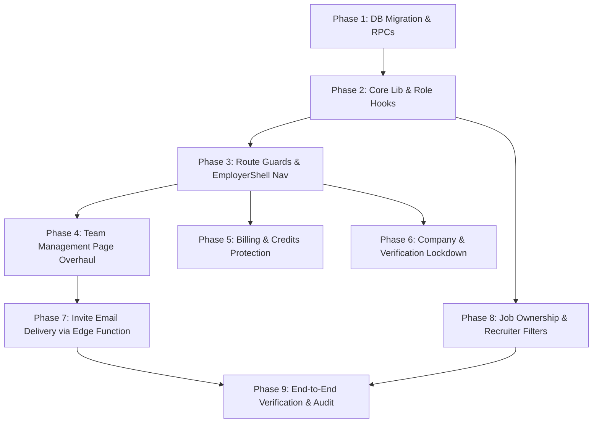

# Multi-User Recruiter Roles & RBAC: Technical Implementation Roadmap
## JobsKart Employer Portal & Supabase Database Layer

> **Document Status**: Production Blueprint & Step-by-Step Technical Execution Plan  
> **Target Version**: JobsKart Multi-User RBAC v1.0  
> **Related Documents**: [`multi-user-recruiter-roles-implementation-plan.md`](file:///c:/Users/user/Desktop/jobskart/multi-user-recruiter-roles-implementation-plan.md)  
> **Safety Notice**: Follows Lovable git safety guidelines (no rebase/force-push; backwards-compatible migrations).

---

## 1. Executive Summary & Architecture Blueprint

JobsKart supports three distinct employer roles defined in the database enum `public.employer_role`:
1. `super_admin`: Company creator / owner. Complete control over billing, credits, plans, legal KYC verification, team members (invite, promote, demote, revoke, restore), company profile, and all jobs/applications.
2. `hr_admin`: HR department lead. Can invite recruiters, manage all jobs and applications, view analytics, update company profile, and view invoices/receipts. **Cannot** purchase plans/credits, downgrade plans, or alter Super Admin roles.
3. `recruiter`: Individual recruiter / talent sourcer. Can post draft/active jobs, view/manage jobs they posted, process candidate applications, schedule interviews, and search candidate database. **Cannot** access billing/credits, cannot change company KYC verification, cannot edit general company settings, and cannot manage team members.

This technical implementation roadmap provides the **exact files, database migrations (DDL/RPCs/RLS), server functions, edge functions, and UI component code modifications** needed to execute the audit plan with zero regressions.

---

## 2. Phase-by-Phase Execution Sequence



---

## 3. Phase 1: Database Hardening & Schema Migration

**Target File**: `supabase/migrations/20260930160000_multi_user_rbac_hardening.sql`

### 3.1 Objective & Security Issues Addressed
1. **Billing & Plan Lockdown**:
   - `create_credit_pack_order()` currently only checks `has_company_membership(_actor, _company_id)`. Any recruiter can initiate checkout orders. Fix: Enforce `has_company_role(_actor, _company_id, 'super_admin')`.
   - `create_plan_order()` currently only checks `has_company_membership(_actor, _company_id)`. Fix: Enforce `has_company_role(_actor, _company_id, 'super_admin')`.
   - `switch_company_plan_to_basic()` currently allows any member to downgrade the subscription. Fix: Enforce `has_company_role(_actor, _company_id, 'super_admin')`.
2. **Invite Token Resolution for Unauthenticated Users**:
   - Migration `20260805034834` revoked `EXECUTE ON FUNCTION get_invite_by_token` from `anon`. As a result, non-logged-in invitees clicking an invite link see "Invite not found or revoked". Fix: Grant `EXECUTE` on `get_invite_by_token(text)` to `anon, authenticated`.
3. **Invite Management RPCs**:
   - Add `cancel_employer_invite(_company_id uuid, _invite_id uuid)`: Super Admin or HR Admin can cancel pending invites.
   - Add `resend_employer_invite(_company_id uuid, _invite_id uuid)`: Refreshes expiration date by 7 days and rotates/maintains token securely.
4. **Company Legal Documents & KYC Protection**:
   - In `public.company_documents`: tighten RLS so `INSERT`, `UPDATE`, and `DELETE` require `has_company_role(auth.uid(), company_id, 'super_admin') OR has_company_role(auth.uid(), company_id, 'hr_admin')`.
   - In `public.company_verifications`: tighten RLS so `INSERT` requires `has_company_role(auth.uid(), company_id, 'super_admin') OR has_company_role(auth.uid(), company_id, 'hr_admin')`.
5. **Job Deletion & Modification Scope**:
   - In `public.jobs`: update `DELETE` and `UPDATE` policies so recruiters can only edit or delete jobs they posted (`posted_by = auth.uid()`), while `super_admin` and `hr_admin` can edit or delete any company job.

### 3.2 Exact SQL Migration Content

```sql
-- ============================================================================
-- Migration: 20260930160000_multi_user_rbac_hardening.sql
-- Description: Multi-User Recruiter Role-Based Access Control Hardening
-- ============================================================================

-- ----------------------------------------------------------------------------
-- 1. Restore Public Token Lookup for Invites (Needed by /invite/$token for anon)
-- ----------------------------------------------------------------------------
GRANT EXECUTE ON FUNCTION public.get_invite_by_token(text) TO anon, authenticated;

-- ----------------------------------------------------------------------------
-- 2. Restrict Credit Pack & Plan Purchase to Super Admins
-- ----------------------------------------------------------------------------
CREATE OR REPLACE FUNCTION public.create_credit_pack_order(
  _company_id uuid,
  _pack_id uuid,
  _actor uuid
) RETURNS jsonb
LANGUAGE plpgsql
SECURITY DEFINER
SET search_path = public
AS $$
DECLARE
  _pack record;
  _subtotal numeric(12,2);
  _gst numeric(12,2);
  _paise bigint;
  _id uuid;
BEGIN
  -- Strict Super Admin check for billing mutations
  IF _actor IS NULL OR NOT public.has_company_role(_actor, _company_id, 'super_admin') THEN
    RAISE EXCEPTION 'Only super admins can purchase credit packs';
  END IF;

  SELECT id, name, credits, price_inr, benefit_type INTO _pack
    FROM public.credit_packs
    WHERE id = _pack_id AND active = true;
  IF NOT FOUND THEN
    RAISE EXCEPTION 'pack_unavailable';
  END IF;

  _subtotal := _pack.price_inr;
  _gst := round(_subtotal * 0.18, 2);
  _paise := round((_subtotal + _gst) * 100)::bigint;

  INSERT INTO public.razorpay_orders (
    company_id, pack_id, amount_inr, credits,
    subtotal_inr, gst_inr, amount_paise, status, created_by, benefit_type
  ) VALUES (
    _company_id, _pack.id, _pack.price_inr, _pack.credits,
    _subtotal, _gst, _paise, 'created', _actor, _pack.benefit_type
  )
  RETURNING id INTO _id;

  RETURN jsonb_build_object(
    'order_id', _id,
    'amount_paise', _paise,
    'subtotal_inr', _subtotal,
    'gst_inr', _gst,
    'credits', _pack.credits,
    'pack_name', _pack.name
  );
END;
$$;

CREATE OR REPLACE FUNCTION public.create_plan_order(
  _company_id uuid,
  _plan_id uuid,
  _actor uuid
) RETURNS jsonb
LANGUAGE plpgsql
SECURITY DEFINER
SET search_path = public
AS $$
DECLARE
  _plan record;
  _subtotal numeric(12,2);
  _gst numeric(12,2);
  _paise bigint;
  _id uuid;
BEGIN
  -- Strict Super Admin check for plan purchases
  IF _actor IS NULL OR NOT public.has_company_role(_actor, _company_id, 'super_admin') THEN
    RAISE EXCEPTION 'Only super admins can purchase subscriptions';
  END IF;

  SELECT id, name, price_inr INTO _plan
    FROM public.plans
    WHERE id = _plan_id AND is_custom = false;
  IF NOT FOUND THEN
    RAISE EXCEPTION 'plan_unavailable';
  END IF;

  IF _plan.price_inr <= 0 THEN
    RAISE EXCEPTION 'plan_not_purchasable';
  END IF;

  _subtotal := _plan.price_inr;
  _gst := round(_subtotal * 0.18, 2);
  _paise := round((_subtotal + _gst) * 100)::bigint;

  INSERT INTO public.razorpay_orders (
    company_id, plan_id, amount_inr, credits,
    subtotal_inr, gst_inr, amount_paise, status, created_by
  ) VALUES (
    _company_id, _plan.id, _plan.price_inr, 0,
    _subtotal, _gst, _paise, 'created', _actor
  )
  RETURNING id INTO _id;

  RETURN jsonb_build_object(
    'order_id', _id,
    'amount_paise', _paise,
    'subtotal_inr', _subtotal,
    'gst_inr', _gst,
    'plan_name', _plan.name
  );
END;
$$;

CREATE OR REPLACE FUNCTION public.switch_company_plan_to_basic(
  _company_id uuid,
  _actor uuid
) RETURNS void
LANGUAGE plpgsql
SECURITY DEFINER
SET search_path = public
AS $$
BEGIN
  -- Strict Super Admin check for plan downgrade
  IF _actor IS NULL OR NOT public.has_company_role(_actor, _company_id, 'super_admin') THEN
    RAISE EXCEPTION 'Only super admins can downgrade the company subscription';
  END IF;

  PERFORM pg_advisory_xact_lock(hashtext(_company_id::text));

  UPDATE public.company_plans
    SET status = 'cancelled'
    WHERE company_id = _company_id AND status = 'active';
END;
$$;

-- ----------------------------------------------------------------------------
-- 3. Cancel and Resend Invite RPCs
-- ----------------------------------------------------------------------------
CREATE OR REPLACE FUNCTION public.cancel_employer_invite(_company_id uuid, _invite_id uuid)
RETURNS void
LANGUAGE plpgsql
SECURITY DEFINER
SET search_path = public
AS $$
DECLARE
  _is_authorized boolean;
  _inv public.employer_invites%ROWTYPE;
BEGIN
  _is_authorized := public.has_company_role(auth.uid(), _company_id, 'super_admin')
                 OR public.has_company_role(auth.uid(), _company_id, 'hr_admin');
  IF NOT _is_authorized THEN
    RAISE EXCEPTION 'Only super admins and HR admins can cancel invites';
  END IF;

  SELECT * INTO _inv FROM public.employer_invites
    WHERE id = _invite_id AND company_id = _company_id;
  IF NOT FOUND THEN
    RAISE EXCEPTION 'Invite not found';
  END IF;

  IF _inv.accepted_at IS NOT NULL THEN
    RAISE EXCEPTION 'Cannot cancel an invite that has already been accepted';
  END IF;

  DELETE FROM public.employer_invites WHERE id = _invite_id;

  PERFORM public.log_employer_activity(
    _company_id, auth.uid(), 'team.invite_cancelled',
    'Invitation cancelled',
    'Invitation for ' || _inv.email || ' was cancelled',
    '/employer/team',
    jsonb_build_object('invite_id', _invite_id, 'email', _inv.email)
  );
END;
$$;

GRANT EXECUTE ON FUNCTION public.cancel_employer_invite(uuid, uuid) TO authenticated;

CREATE OR REPLACE FUNCTION public.resend_employer_invite(_company_id uuid, _invite_id uuid)
RETURNS jsonb
LANGUAGE plpgsql
SECURITY DEFINER
SET search_path = public
AS $$
DECLARE
  _is_authorized boolean;
  _inv public.employer_invites%ROWTYPE;
  _new_token text;
  _new_expiry timestamptz;
BEGIN
  _is_authorized := public.has_company_role(auth.uid(), _company_id, 'super_admin')
                 OR public.has_company_role(auth.uid(), _company_id, 'hr_admin');
  IF NOT _is_authorized THEN
    RAISE EXCEPTION 'Only super admins and HR admins can resend invites';
  END IF;

  SELECT * INTO _inv FROM public.employer_invites
    WHERE id = _invite_id AND company_id = _company_id;
  IF NOT FOUND THEN
    RAISE EXCEPTION 'Invite not found';
  END IF;

  IF _inv.accepted_at IS NOT NULL THEN
    RAISE EXCEPTION 'Cannot resend an invite that has already been accepted';
  END IF;

  -- Generate secure token and 7-day expiration
  _new_token := encode(gen_random_bytes(24), 'hex');
  _new_expiry := now() + interval '7 days';

  UPDATE public.employer_invites
    SET token = _new_token, expires_at = _new_expiry
    WHERE id = _invite_id;

  PERFORM public.log_employer_activity(
    _company_id, auth.uid(), 'team.invite_resent',
    'Invitation resent',
    'Invitation for ' || _inv.email || ' was refreshed',
    '/employer/team',
    jsonb_build_object('invite_id', _invite_id, 'email', _inv.email)
  );

  RETURN jsonb_build_object(
    'id', _invite_id,
    'email', _inv.email,
    'token', _new_token,
    'expires_at', _new_expiry
  );
END;
$$;

GRANT EXECUTE ON FUNCTION public.resend_employer_invite(uuid, uuid) TO authenticated;

-- ----------------------------------------------------------------------------
-- 4. Tighten Company Documents & Legal KYC RLS
-- ----------------------------------------------------------------------------
DROP POLICY IF EXISTS "Company members manage their documents" ON public.company_documents;

CREATE POLICY "Company members can view documents" ON public.company_documents
  FOR SELECT TO authenticated
  USING (public.has_company_membership(auth.uid(), company_id));

CREATE POLICY "Admins can insert company documents" ON public.company_documents
  FOR INSERT TO authenticated
  WITH CHECK (
    public.has_company_role(auth.uid(), company_id, 'super_admin')
    OR public.has_company_role(auth.uid(), company_id, 'hr_admin')
  );

CREATE POLICY "Admins can update company documents" ON public.company_documents
  FOR UPDATE TO authenticated
  USING (
    public.has_company_role(auth.uid(), company_id, 'super_admin')
    OR public.has_company_role(auth.uid(), company_id, 'hr_admin')
  )
  WITH CHECK (
    public.has_company_role(auth.uid(), company_id, 'super_admin')
    OR public.has_company_role(auth.uid(), company_id, 'hr_admin')
  );

CREATE POLICY "Admins can delete company documents" ON public.company_documents
  FOR DELETE TO authenticated
  USING (
    public.has_company_role(auth.uid(), company_id, 'super_admin')
    OR public.has_company_role(auth.uid(), company_id, 'hr_admin')
  );

-- Tighten company_verifications insert
DROP POLICY IF EXISTS "cv members insert" ON public.company_verifications;
CREATE POLICY "Admins can submit company verifications" ON public.company_verifications
  FOR INSERT TO authenticated
  WITH CHECK (
    public.has_company_role(auth.uid(), company_id, 'super_admin')
    OR public.has_company_role(auth.uid(), company_id, 'hr_admin')
  );

-- ----------------------------------------------------------------------------
-- 5. Tighten Job UPDATE and DELETE RLS for Multi-Recruiter Isolation
-- ----------------------------------------------------------------------------
DROP POLICY IF EXISTS "Company members can update jobs" ON public.jobs;
CREATE POLICY "Authorized members can update jobs" ON public.jobs
  FOR UPDATE TO authenticated
  USING (
    public.has_company_role(auth.uid(), company_id, 'super_admin')
    OR public.has_company_role(auth.uid(), company_id, 'hr_admin')
    OR (public.has_company_membership(auth.uid(), company_id) AND posted_by = auth.uid())
  )
  WITH CHECK (
    public.has_company_role(auth.uid(), company_id, 'super_admin')
    OR public.has_company_role(auth.uid(), company_id, 'hr_admin')
    OR (public.has_company_membership(auth.uid(), company_id) AND posted_by = auth.uid())
  );

DROP POLICY IF EXISTS "Company members can delete jobs" ON public.jobs;
CREATE POLICY "Authorized members can delete jobs" ON public.jobs
  FOR DELETE TO authenticated
  USING (
    public.has_company_role(auth.uid(), company_id, 'super_admin')
    OR public.has_company_role(auth.uid(), company_id, 'hr_admin')
    OR (public.has_company_membership(auth.uid(), company_id) AND posted_by = auth.uid() AND status = 'draft')
  );
```

---

## 4. Phase 2: Core Employer Access & Role Infrastructure

### 4.1 Update `src/lib/employer.ts`
1. Fix `fetchMyCompanies(userId)`: append `.eq("status", "active")` so revoked members are immediately excluded.
2. Define granular permission helpers:
   - `isSuperAdmin(role: EmployerRole | null): boolean`
   - `isHrAdmin(role: EmployerRole | null): boolean`
   - `isRecruiter(role: EmployerRole | null): boolean`
   - `canManageBilling(role: EmployerRole | null): boolean` (`role === 'super_admin'`)
   - `canManageTeamMembers(role: EmployerRole | null): boolean` (`role === 'super_admin'`)
   - `canInviteMembers(role: EmployerRole | null): boolean` (`role === 'super_admin' || role === 'hr_admin'`)
   - `canEditCompany(role: EmployerRole | null): boolean` (`role === 'super_admin' || role === 'hr_admin'`)
   - `canManageVerification(role: EmployerRole | null): boolean` (`role === 'super_admin' || role === 'hr_admin'`)
   - `canViewReports(role: EmployerRole | null): boolean` (`role === 'super_admin' || role === 'hr_admin'`)
3. Create React Hook `useEmployerRole()`:
   ```ts
   export function useEmployerRole() {
     const [loading, setLoading] = useState(true);
     const [membership, setMembership] = useState<EmployerMembership | null>(null);
     const [activeCompanyId, setActiveId] = useState<string | null>(getActiveCompanyId());
     ...
     return {
       loading,
       company: membership?.companies ?? null,
       role: membership?.role ?? null,
       companyId: membership?.company_id ?? null,
       isSuperAdmin: membership?.role === "super_admin",
       isHrAdmin: membership?.role === "hr_admin",
       isRecruiter: membership?.role === "recruiter",
       canManageBilling: membership?.role === "super_admin",
       canManageTeamMembers: membership?.role === "super_admin",
       canInviteMembers: membership?.role === "super_admin" || membership?.role === "hr_admin",
       canEditCompany: membership?.role === "super_admin" || membership?.role === "hr_admin",
       canManageVerification: membership?.role === "super_admin" || membership?.role === "hr_admin",
       canViewReports: membership?.role === "super_admin" || membership?.role === "hr_admin",
       refresh: () => { ... }
     };
   }
   ```

### 4.2 Update `src/lib/employer-nav.ts`
Add role requirements to navigation items so the sidebar and mobile drawer can hide or badge restricted sections:
```ts
export type EmployerNavItem = {
  to: string;
  label: string;
  icon: LucideIcon;
  minRole?: "super_admin" | "hr_admin";
};

export const EMPLOYER_NAV_LINKS: EmployerNavItem[] = [
  { to: "/employer/dashboard", label: "Dashboard", icon: LayoutDashboard },
  { to: "/employer/jobs", label: "Jobs", icon: Briefcase },
  { to: "/employer/responses", label: "Responses", icon: Inbox },
  { to: "/employer/crm", label: "CRM", icon: PhoneCall },
  { to: "/employer/interviews", label: "Interviews", icon: CalendarCheck },
  { to: "/employer/database", label: "Database", icon: Database },
  { to: "/employer/jobs/bulk", label: "Bulk post", icon: FileSpreadsheet },
  { to: "/employer/verification", label: "Verification", icon: BadgeCheck, minRole: "hr_admin" },
  { to: "/employer/reports", label: "Reports", icon: BarChart3, minRole: "hr_admin" },
  { to: "/employer/activity", label: "Activity", icon: Activity },
  { to: "/employer/credits", label: "Credits", icon: Coins, minRole: "super_admin" },
  { to: "/employer/company", label: "Company", icon: Building2 },
  { to: "/employer/team", label: "Team", icon: Users, minRole: "hr_admin" },
];
```

---

## 5. Phase 3: Route-Level RBAC & EmployerShell Gating

### 5.1 Modify `src/components/employer/EmployerShell.tsx`
1. Use `useEmployerRole()` inside `EmployerShell` and `CreditChip`.
2. Filter sidebar links:
   - If `item.minRole === 'super_admin'`, only show if `isSuperAdmin`.
   - If `item.minRole === 'hr_admin'`, only show if `isSuperAdmin || isHrAdmin`.
3. Update `CreditChip`:
   - If user is `recruiter`, display remaining credits count, but replace `"Buy Credits →"` with a subtle subtitle `"Managed by Super Admin"`, or omit the purchase button entirely.
4. Add user role badge in header or sidebar profile snippet (e.g. `Super Admin`, `HR Admin`, `Recruiter`).

### 5.2 Add Shared Role Gating Component `src/components/employer/RoleGate.tsx`
```tsx
export function RoleGate({
  allowed,
  children,
  fallback,
}: {
  allowed: boolean;
  children: ReactNode;
  fallback?: ReactNode;
}) {
  if (allowed) return <>{children}</>;
  if (fallback) return <>{fallback}</>;
  return (
    <div className="rounded-2xl border border-border bg-card p-12 text-center shadow-[var(--shadow-card)]">
      <ShieldAlert className="mx-auto h-12 w-12 text-muted-foreground" />
      <h2 className="mt-4 text-xl font-bold text-foreground">Access Restricted</h2>
      <p className="mt-2 text-sm text-muted-foreground max-w-md mx-auto">
        Your role does not have permission to view or manage this section. Please contact your company's Super Admin for access.
      </p>
      <Link
        to="/employer/dashboard"
        className="mt-6 inline-flex h-10 items-center justify-center rounded-lg bg-primary px-5 text-sm font-semibold text-primary-foreground hover:bg-primary-dark"
      >
        Return to Dashboard
      </Link>
    </div>
  );
}
```

---

## 6. Phase 4: Team Management Page (`/employer/team`) Overhaul

**Target File**: `src/routes/_authenticated/employer/team.tsx`

### 6.1 Fix Existing Critical Bugs in `team.tsx`
1. **Reactivate Button Bug**:
   - Line 332 currently passes `m.userId` instead of `m.user_id`. Fix: `reactivateMember(m.user_id, name)`.
2. **Visual Role Badge Rendering Bug**:
   - Line 282 currently outputs raw CSS strings: `{roleBadgeClass(m.role)}`.
   - Fix:
     ```tsx
     <span className={`inline-flex items-center rounded-full px-2.5 py-0.5 text-xs font-semibold ${roleBadgeClass(m.role)}`}>
       {formatRole(m.role)}
     </span>
     ```
3. **Dead Nav Link**:
   - Line 224 currently has `// TODO: navigate to dashboard`.
   - Fix: Replace aside with TanStack Router link or rely on unified `EmployerShell`.

### 6.2 Wire Proper RPC Calls
1. **Revoke Member**:
   - Replace client-side `.update()` with:
     ```ts
     const { error } = await supabase.rpc("remove_member", {
       _company_id: cid,
       _user_id: userId,
     });
     ```
   - This enforces the database-level check: `Cannot revoke the last super admin` and records audit history.
2. **Reactivate Member**:
   - Replace client-side `.update()` with:
     ```ts
     const { error } = await supabase.rpc("reactivate_member", {
       _company_id: cid,
       _user_id: userId,
       _role: "recruiter",
     });
     ```
3. **Role Change Dropdown & Handler (New Feature)**:
   - For each active member (when viewer is `super_admin`):
     - Display a `<select>` or dropdown with options: `Super Admin`, `HR Admin`, `Recruiter`.
     - Disable changing own role or demoting the last super admin.
     - Handler calls:
       ```ts
       const handleRoleChange = async (targetUserId: string, newRole: EmployerRole) => {
         const { error } = await supabase.rpc("update_member_role", {
           _company_id: cid,
           _user_id: targetUserId,
           _role: newRole,
         });
         if (error) return toast.error(error.message);
         toast.success("Member role updated.");
         await load();
       };
       ```

### 6.3 Invite Link Management & Display
1. **Secure Token Generation**:
   - Replace `Math.random().toString(36)` with crypto-secure random token generation or rely on server RPC.
2. **Display Invite Link Modal/Banner**:
   - After `sendInvite()` finishes, store `lastCreatedInvite = { token, email, role }`.
   - Render a confirmation dialog or banner:
     ```tsx
     <div className="rounded-xl border border-primary/30 bg-primary-light/30 p-4">
       <p className="text-sm font-semibold text-primary">Invitation Created!</p>
       <p className="text-xs text-muted-foreground mt-1">Share this link with {lastCreatedInvite.email}:</p>
       <div className="mt-2 flex items-center gap-2">
         <input
           readOnly
           value={`${window.location.origin}/invite/${lastCreatedInvite.token}`}
           className="flex-1 rounded-lg border border-border bg-card px-3 py-1.5 text-xs text-foreground"
         />
         <button onClick={copyLink} className="rounded-lg bg-primary px-3 py-1.5 text-xs text-primary-foreground">
           Copy Link
         </button>
       </div>
     </div>
     ```
3. **Pending Invites Actions**:
   - In the pending invites table, add action buttons:
     - **Copy Link**: Copies `${window.location.origin}/invite/${inv.token}` to clipboard.
     - **Resend**: Calls `supabase.rpc("resend_employer_invite", { _company_id: cid, _invite_id: inv.id })`.
     - **Cancel**: Calls `supabase.rpc("cancel_employer_invite", { _company_id: cid, _invite_id: inv.id })`.

---

## 7. Phase 5: Billing & Credits Protection (`/employer/credits`)

**Target File**: `src/routes/_authenticated/employer/credits.tsx`

1. **Role Gating at Route Level**:
   - Wrap the purchase section and pack cards with `<RoleGate allowed={isSuperAdmin}>`.
   - If viewer is `hr_admin`:
     - Can view current wallet balances, monthly allowance progress, transaction history, and download tax invoices.
     - "Buy Pack" and "Upgrade / Switch Plan" buttons are hidden or disabled with a badge: *"Purchases restricted to Super Admin"*.
   - If viewer is `recruiter`:
     - Entire `/employer/credits` page is blocked by `<RoleGate allowed={false}>` with clear guidance.
2. **Server-Side Enforcement**:
   - `createRazorpayOrder` and `createPlanOrder` in `src/lib/credits.functions.ts` are protected by the DB RPCs updated in Phase 1 (`has_company_role(_actor, _company_id, 'super_admin')`).

---

## 8. Phase 6: Company & Verification Lockdown

### 8.1 Company Profile (`/employer/company`)
**Target File**: `src/routes/_authenticated/employer/company.tsx`
1. Load `myRole` via `useEmployerRole()`.
2. If `!canEditCompany`:
   - Set all form inputs (`name`, `industry`, `website`, `about`, `hq_city`, `founded_year`, `gst_number`, `pan_number`) to `disabled`.
   - Hide the "Save changes" submit button.
   - Hide logo file upload input and document upload trigger.
   - Display informative alert: *"Viewing company details in read-only mode. Only Super Admins and HR Admins can edit company settings."*

### 8.2 Verification KYC (`/employer/verification`)
**Target File**: `src/routes/_authenticated/employer/verification.tsx`
1. Load `myRole` via `useEmployerRole()`.
2. If `!canManageVerification`:
   - Disable submission form (GST/CIN inputs, file dropzone).
   - Allow viewing current company verification status badge and previously approved documents.
   - Display banner: *"Legal company KYC and verification can only be submitted by Super Admins or HR Admins."*

---

## 9. Phase 7: Automated Invite Email Delivery via Edge Function

**Target Directory**: `supabase/functions/send-employer-invite/`

1. **Edge Function Implementation (`index.ts`)**:
   - Validates authorization header via `supabaseAdmin`.
   - Accepts `{ companyId, email, role, token, inviterName }`.
   - Checks that caller has `super_admin` or `hr_admin` role in `companyId`.
   - Formats email using standard brand templates from `_shared/templates.ts`.
   - Sends email using `sendEmail` from `_shared/resend.ts`.
2. **Frontend Trigger in `team.tsx`**:
   - In `sendInvite()`: after inserting the invite or generating the token, invoke:
     ```ts
     await supabase.functions.invoke("send-employer-invite", {
       body: {
         companyId: cid,
         email,
         role,
         token,
       },
     });
     ```
   - If Resend API key is not configured or in development mode, the function logs a fallback link to the console, and the UI toast displays: *"Invite created! Link copied to clipboard."*

---

## 10. Phase 8: Multi-Recruiter Job Ownership & Filtering

**Target Files**:
- `src/routes/_authenticated/employer/jobs.tsx`
- `src/components/employer/JobWizard.tsx`

1. **Job Ownership Attribution**:
   - In `jobs.tsx`, include `posted_by` in the select query.
   - Join or lookup recruiter profiles to show: `"Posted by: Jane Doe"` under the job title.
2. **Recruiter-Specific View Filter**:
   - Add a segmented filter or dropdown next to status filters:
     - `All Jobs` (Default for Super Admin & HR Admin)
     - `My Jobs` (Filters where `posted_by === auth.uid()`)
   - For `recruiter` role, default to `My Jobs` or keep `All Jobs` viewable while visibly flagging their own postings.
3. **Action Gating**:
   - If user is `recruiter` and `job.posted_by !== auth.uid()`:
     - "Edit Job" and "Delete Job" buttons are hidden/disabled.
     - "View Responses" remains accessible so recruiting teammates can collaborate on applicant reviews.

---

## 11. Phase 9: Verification & Testing Matrix

| Test ID | Role | Test Action | Expected Result |
|---|---|---|---|
| **T-01** | `recruiter` | Navigate to `/employer/credits` | Route blocked; `<RoleGate>` displays access restricted banner. |
| **T-02** | `recruiter` | Call `createRazorpayOrder` API directly | Fails with DB exception: `"Only super admins can purchase credit packs"`. |
| **T-03** | `hr_admin` | Navigate to `/employer/credits` | Can inspect balances, transaction history, and download invoices; cannot purchase packs or plans. |
| **T-04** | `super_admin` | Navigate to `/employer/credits` | Full access to buy packs, purchase/upgrade plans, and download invoices. |
| **T-05** | `recruiter` | Navigate to `/employer/company` | Fields disabled; read-only mode; "Save" button hidden. |
| **T-06** | `hr_admin` | Navigate to `/employer/company` | Can edit and save company details; logo upload works. |
| **T-07** | `super_admin` | Demote sole super admin in `/employer/team` | Fails with toast & DB exception: `"Cannot demote the last super admin"`. |
| **T-08** | `super_admin` | Revoke a recruiter in `/employer/team` | Member status updated to `revoked`; audit event logged; soft-delete preserves historical data. |
| **T-09** | `super_admin` | Restore revoked member | Member status restored to `active`; restores login access. |
| **T-10** | `anon` | Click `/invite/<valid-token>` while signed out | `get_invite_by_token` succeeds; company name and role display; prompts sign-in or registration. |
| **T-11** | `recruiter` | Try editing job posted by another recruiter | Edit button hidden or disabled; direct update blocked by RLS. |
| **T-12** | `hr_admin` | Cancel pending invite in `/employer/team` | Invite row deleted; activity logged; invite link becomes invalid. |

---

## 12. Implementation Checklist & Progress Tracker

- [ ] **Step 1**: Create migration `20260930160000_multi_user_rbac_hardening.sql` with hardened RPCs and RLS policies.
- [ ] **Step 2**: Update `src/lib/employer.ts` (filter `status='active'`, export `useEmployerRole()`, export permission helpers).
- [ ] **Step 3**: Update `src/lib/employer-nav.ts` (assign `minRole` metadata to restricted routes).
- [ ] **Step 4**: Update `src/components/employer/EmployerShell.tsx` (role-filtered sidebar and drawer, role badge in UI).
- [ ] **Step 5**: Create `src/components/employer/RoleGate.tsx` reusable guard component.
- [ ] **Step 6**: Refactor `src/routes/_authenticated/employer/team.tsx` (fix reactivate bug, role badge CSS bug, wire `remove_member` and `update_member_role` RPCs, add invite copy/resend/cancel UI).
- [ ] **Step 7**: Update `src/routes/_authenticated/employer/credits.tsx` (gate purchase actions to `super_admin`, allow read-only invoice view for `hr_admin`, block `recruiter`).
- [ ] **Step 8**: Update `src/routes/_authenticated/employer/company.tsx` (disable inputs for `recruiter`).
- [ ] **Step 9**: Update `src/routes/_authenticated/employer/verification.tsx` (restrict KYC submission to `super_admin` and `hr_admin`).
- [ ] **Step 10**: Create edge function `supabase/functions/send-employer-invite/` and trigger it on invite creation.
- [ ] **Step 11**: Update `src/routes/_authenticated/employer/jobs.tsx` (add `posted_by` attribution and recruiter filter).
- [ ] **Step 12**: Run complete manual test suite T-01 through T-12 to ensure zero regressions.
